# LNL-Solver
This is LNL-Solver a tool to solve Linear and Non-Linear System using iterative standard methods

# Guía gráfica del Willmers' Solver

**Cómo importar, usar y entender `LNL-Solver.py`**

El archivo `LNL-Solver.py` funciona como una pequeña librería personal para resolver sistemas lineales y sistemas no lineales desde notebooks de Python.


## Índice

- [Mapa general](#mapa-general)
- [Importar el solver en un notebook](#importar-el-solver-en-un-notebook)
- [Flujo para sistemas lineales](#flujo-para-sistemas-lineales)
- [Métodos lineales disponibles](#métodos-lineales-disponibles)
- [Criterios de parada lineales](#criterios-de-parada-lineales)
- [Qué devuelve un método lineal](#qué-devuelve-un-método-lineal)
- [Historial de iteraciones](#historial-de-iteraciones)
- [Flujo para sistemas no lineales](#flujo-para-sistemas-no-lineales)
- [Newton-Raphson](#newton-raphson)
- [Punto fijo](#punto-fijo-en-sistemas-no-lineales)
- [Cómo leer `show_solution_set`](#cómo-leer-show_solution_set)
- [Diagnóstico rápido de errores](#diagnóstico-rápido-de-errores)
- [Recetas de uso](#recetas-de-uso)
- [Ejemplos tomados de la práctica](#ejemplos-tomados-de-la-práctica)
- [Checklist antes de entregar](#checklist-antes-de-entregar)

---

## Mapa general

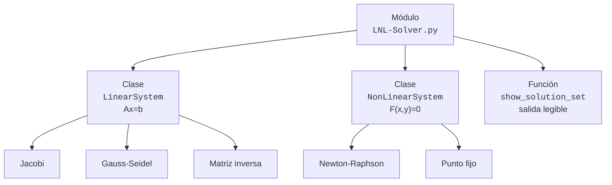

| Objeto | Para qué sirve |
|---|---|
| `LinearSystem` | Resolver sistemas lineales \(Ax=b\), revisar dominancia diagonal y usar Jacobi, Gauss-Seidel o método directo. |
| `NonLinearSystem` | Resolver sistemas no lineales de dos variables mediante Newton-Raphson o punto fijo. |
| `show_solution_set` | Imprimir una solución con nombres de variables, número de iteraciones y error. |

> **Idea central.** En vez de reescribir las clases en cada notebook, se guarda el solver en un archivo `.py` y se importa cuando se necesita resolver un sistema.

---

## Importar el Solver en un Notebook

### Caso recomendado: el notebook está en la misma carpeta

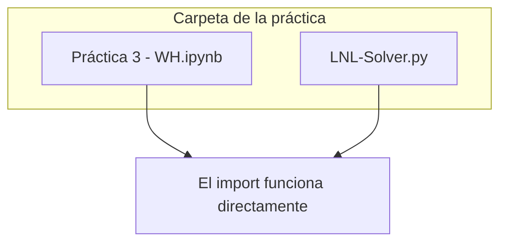

La celda de importación debe verse así:

```python
import numpy as np
from LNL-Solver import *
```

> **Detalle importante.** En Python se importa el nombre del módulo, no el nombre del archivo con extensión.

Correcto:

```python
from LNL-Solver import *
```

Incorrecto:

```python
from LNL-Solver.py import *
```

### Si el notebook está en otra carpeta


```python
import sys
import numpy as np

sys.path.append(
    r"/Users/sr3m/Library/CloudStorage/OneDrive-Personal/6. Research & Development/2. MSc Pure Mathematics/Análisis Numérico/Clases/0. Tareas/2. Práctica 3"
)

from LNL-Solver import *
```

Si editas `LNL-Solver.py` y el notebook no reconoce los cambios, reinicia el kernel o recarga el módulo:

```python
import LNL-Solver
from importlib import reload

reload(LNL-Solver)
from LNL-Solver import *
```

---

## Flujo Para Sistemas Lineales

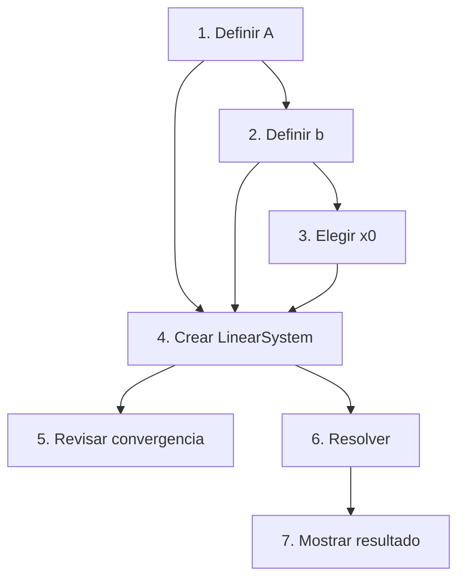

### Plantilla mínima

```python
import numpy as np
from LNL-Solver import *

A = np.array([
    [-2, 1, 0, 0],
    [1, -2, 1, 0],
    [0, 1, -2, 1],
    [0, 0, 1, -2]
])

b = np.array([[1], [2], [-7], [-1]])
x0 = [0, 0, 0, 0]

system = LinearSystem(A, b, x0)
system.convergence()

solution, iterations, error = system.solved_by_gauss_seidel(
    'max_iteration',
    max_iteration=5
)

show_solution_set(solution, iterations, 'x', error)
```

| Línea | Significado |
|---|---|
| `A = np.array(...)` | Matriz de coeficientes del sistema. |
| `b = np.array(...)` | Vector de términos independientes. |
| `x0 = [...]` | Punto inicial para métodos iterativos. |
| `LinearSystem(A,b,x0)` | Construye el objeto que sabe resolver el sistema. |
| `convergence()` | Indica si la matriz es diagonalmente dominante. |
| `solved_by_gauss_seidel(...)` | Ejecuta Gauss-Seidel hasta cumplir el criterio elegido. |

---

## Métodos Lineales Disponibles

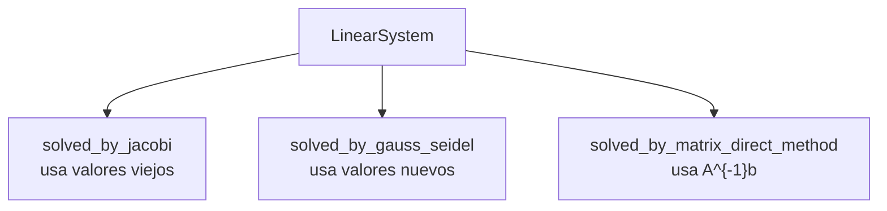

| Método | Cuándo usarlo | Llamada típica |
|---|---|---|
| Jacobi | Comparar métodos iterativos o cuando se quiere una actualización por bloque. | `solved_by_jacobi(...)` |
| Gauss-Seidel | Método iterativo usual; aprovecha los valores recién calculados. | `solved_by_gauss_seidel(...)` |
| Directo | Para obtener una solución exacta numérica si \(A\) es invertible. | `solved_by_matrix_direct_method()` |

| Método | Idea matemática | Detalle computacional |
|---|---|---|
| Jacobi | Calcula cada \(x_i^{(k+1)}\) usando solo valores de \(x^{(k)}\). | Es más fácil de comparar y paralelizar, pero suele necesitar más iteraciones. |
| Gauss-Seidel | Calcula \(x_i^{(k+1)}\) usando los valores nuevos apenas están disponibles. | Suele converger más rápido que Jacobi cuando la matriz se presta para iteración. |
| Directo | Calcula \(x=A^{-1}b\). | No genera historial iterativo; sirve como referencia si \(A\) es cuadrada e invertible. |

Jacobi:

$$
x_i^{(k+1)}=
\frac{1}{a_{ii}}
\left(
b_i-\sum_{j\ne i}a_{ij}x_j^{(k)}
\right)
$$

Gauss-Seidel:

$$
x_i^{(k+1)}=
\frac{1}{a_{ii}}
\left(
b_i-\sum_{j<i}a_{ij}x_j^{(k+1)}
-\sum_{j>i}a_{ij}x_j^{(k)}
\right)
$$

> **Una llamada sin argumentos hace una sola iteración.**

```python
system.solved_by_gauss_seidel()
```

Si quieres que el método se detenga automáticamente, debes pasar un criterio de parada:

```python
solution, iterations, error = system.solved_by_gauss_seidel(
    'residue',
    tol=1e-5
)
```

---

## Criterios de Parada Lineales

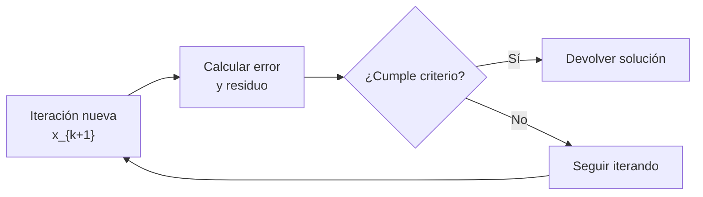

| Criterio | Qué revisa | Ejemplo |
|---|---|---|
| `max_iteration` | Se detiene al llegar al número máximo de iteraciones. | `max_iteration=20` |
| `absolute_error` | Norma euclidiana de \(x_{k+1}-x_k\). | `tol=1e-4` |
| `max_absolute_error` | Mayor cambio componente a componente. | `tol=1e-4` |
| `relative_error` | Error absoluto dividido entre la norma del punto actual. | `tol=1e-5` |
| `residue` | Norma del residuo \(Ax-b\). | `tol=1e-5` |
| `combined` | Exige simultáneamente error absoluto máximo y residuo. | `absolute_tol=1e-4`, `residue_tol=1e-5` |

```python
# Ejemplos de criterios
system.solved_by_gauss_seidel('max_iteration', max_iteration=10)
system.solved_by_gauss_seidel('absolute_error', tol=1e-5)
system.solved_by_gauss_seidel('relative_error', tol=1e-5)
system.solved_by_gauss_seidel('residue', tol=1e-5)
system.solved_by_gauss_seidel('max_absolute_error', tol=1e-5)
system.solved_by_gauss_seidel(
    'combined',
    absolute_tol=1e-5,
    residue_tol=1e-5
)
```

### Cómo escoger el criterio lineal

| Necesidad | Criterio recomendado | Por qué |
|---|---|---|
| Solo repetir un número fijo de veces | `max_iteration` | Sirve para tareas donde piden exactamente \(n\) iteraciones. |
| Comparar convergencia entre métodos | `absolute_error` | Mide el tamaño del salto \(x_{k+1}-x_k\). |
| Controlar el peor cambio individual | `max_absolute_error` | Útil si ninguna variable debe moverse más que cierta tolerancia. |
| Variables con escalas muy distintas | `relative_error` | Normaliza el salto por el tamaño de la solución actual. |
| Comprobar que \(Ax=b\) se cumple | `residue` | Mide directamente el defecto \(Ax-b\). |
| Entrega más rigurosa | `combined` | Exige simultáneamente poco cambio y bajo residuo. |

> **Recomendación práctica.** Para reportes, usa `residue` o `combined`. Para estudiar la velocidad del método, usa `absolute_error` y grafica `system.history`. Para una actividad donde se piden cinco iteraciones, usa `max_iteration`.

---

## Qué Devuelve un Método Lineal

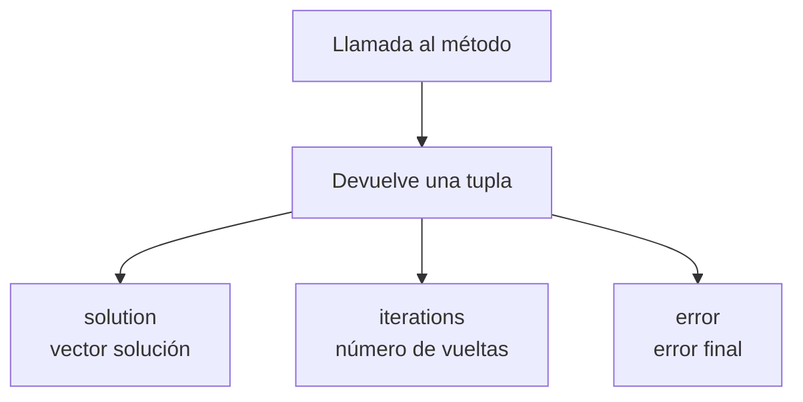

```python
solution, iterations, error = system.solved_by_gauss_seidel(
    'combined',
    absolute_tol=1e-5,
    residue_tol=1e-5
)

show_solution_set(solution, iterations, 'x', error)
```

> **Historial de iteraciones.** Cuando usas un criterio de parada, el solver guarda información en `system.history`. Esto sirve para hacer tablas o gráficas de convergencia.

```python
for item in system.history:
    print(item['iteration'], item['solution'], item['residue'])
```

---

## Historial de Iteraciones

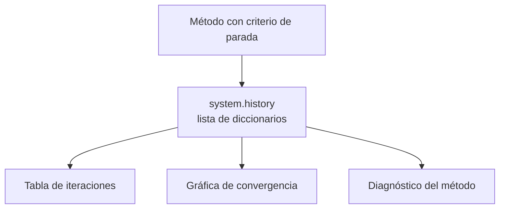

`history` es la memoria de la ejecución. Cada elemento de la lista corresponde a una iteración y guarda la aproximación calculada junto con las medidas de error disponibles.

Se reinicia cada vez que ejecutas de nuevo un método con criterio de parada.

### Qué guarda en sistemas lineales

| Clave | Contenido |
|---|---|
| `iteration` | Número de iteración: \(1,2,3,\ldots\). |
| `solution` | Vector \(x_k\) obtenido en esa iteración. |
| `absolute_error` | \(\|x_k-x_{k-1}\|_2\). |
| `max_absolute_error` | \(\max_i |x_{k,i}-x_{k-1,i}|\). |
| `relative_error` | \(\|x_k-x_{k-1}\|_2/\|x_k\|_2\). |
| `residue` | \(\|Ax_k-b\|\), por defecto con norma euclidiana. |

```python
solution, iterations, error = system.solved_by_gauss_seidel(
    'combined',
    absolute_tol=1e-5,
    residue_tol=1e-5
)

# Primer registro del historial
system.history[0]

# Último registro del historial
system.history[-1]
```

Forma típica de un registro lineal:

```python
{
    'iteration': 5,
    'solution': array([0.750002, 0.833331, 2.083330]),
    'absolute_error': 0.000041,
    'max_absolute_error': 0.000036,
    'relative_error': 0.000017,
    'residue': 0.000098
}
```

### Convertir el historial en tabla

```python
import pandas as pd

history_table = pd.DataFrame(system.history)

# Separar el vector solución en columnas x_1, x_2, ...
solution_columns = pd.DataFrame(
    history_table['solution'].tolist(),
    columns=['x_1', 'x_2', 'x_3']
)

history_table = pd.concat(
    [history_table.drop(columns=['solution']), solution_columns],
    axis=1
)

history_table.round(6)
```

| iter | \(x_1\) | \(x_2\) | \(x_3\) | err. abs. | residuo |
|---:|---:|---:|---:|---:|---:|
| 1 | 2.000000 | 1.000000 | -1.500000 | 2.692582 | 14.500000 |
| 2 | -1.000000 | 1.900000 | 4.550000 | 6.808818 | 28.750000 |
| 3 | -7.050000 | 1.900000 | 16.200000 | 13.125738 | 70.250000 |
| ... | ... | ... | ... | ... | ... |

> **Lectura de la tabla.** Si el error y el residuo bajan, el método está convergiendo. Si crecen o empiezan a oscilar, cambia el orden de las ecuaciones, revisa la dominancia diagonal o usa el método directo como comparación.

### Graficar el historial

```python
import matplotlib.pyplot as plt

errors = [item['absolute_error'] for item in system.history]
residues = [item['residue'] for item in system.history]
iterations = range(1, len(system.history) + 1)

plt.semilogy(iterations, errors, marker='o', label='Error absoluto')
plt.semilogy(iterations, residues, marker='s', label='Residuo')
plt.xlabel('Iteración')
plt.ylabel('Magnitud')
plt.grid(True, alpha=0.3)
plt.legend()
plt.show()
```

---

## Flujo Para Sistemas No Lineales

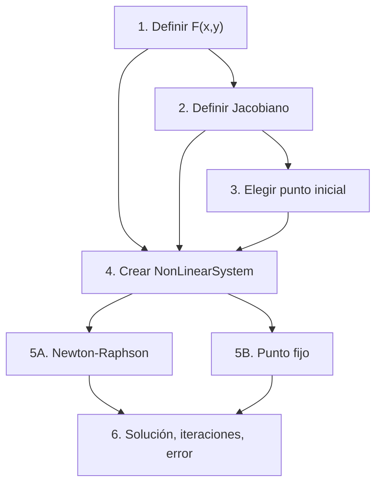

### Ejemplo Newton-Raphson

Sistema:

$$
\begin{cases}
-x^2+x+0.75-y=0,\\
x^2-5xy-y=0.
\end{cases}
$$

```python
import numpy as np
from LNL-Solver import *

functions = [
    lambda x, y: -x**2 + x + 0.75 - y,
    lambda x, y: x**2 - 5*x*y - y
]

jacobian = [
    [lambda x, y: -2*x + 1, lambda x, y: -1],
    [lambda x, y: 2*x - 5*y, lambda x, y: -5*x - 1]
]

system = NonLinearSystem(functions, [1.2, 1.2])

solution, iterations, error = system.solved_by_newton_raphson(
    jacobian,
    tol=0.3/100
)

show_solution_set(solution, iterations, ['x', 'y'], error)
```

---

## Newton-Raphson

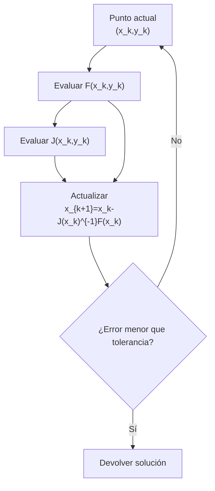

Newton-Raphson suele converger en pocas iteraciones, pero necesita Jacobiano invertible. Si aparece un error de matriz singular, cambia el punto inicial o revisa el Jacobiano.

### Criterios no lineales

| Criterio | Interpretación | Parámetro |
|---|---|---|
| `relative_error` | Error relativo aproximado entre iteraciones. | `tol` |
| `max_absolute_error` | Máximo cambio por variable. | `tol` |
| `absolute_error` | Norma euclidiana del cambio. | `tol` |
| `euclidean_error` | Alias del error absoluto. | `tol` |
| `residue` | Norma de \(F(x,y)\). | `tol` |
| `combined` | Combina máximo cambio y residuo. | dos tolerancias |

En Newton-Raphson, `relative_error`, `absolute_error` y `max_absolute_error` miran el cambio entre dos aproximaciones. En cambio, `residue` mira qué tan cerca está el punto de cumplir \(F(x,y)=0\). Si necesitas una verificación fuerte, usa `combined`.

```python
# El criterio predeterminado es relative_error
system.solved_by_newton_raphson(jacobian, tol=1e-5)

# Criterios alternativos
system.solved_by_newton_raphson(jacobian, stop_criteria='max_absolute_error', tol=1e-6)
system.solved_by_newton_raphson(jacobian, stop_criteria='absolute_error', tol=1e-6)
system.solved_by_newton_raphson(jacobian, stop_criteria='residue', tol=1e-8)
system.solved_by_newton_raphson(
    jacobian,
    stop_criteria='combined',
    absolute_tol=1e-6,
    residue_tol=1e-8
)
```

### Historial no lineal

| Método | Qué queda guardado en `history` |
|---|---|
| Newton-Raphson | `iteration`, `solution`, `error`, `relative_error`, `max_absolute_error`, `absolute_error`, `residue`. |
| Punto fijo | `iteration`, `solution`, `error`. |

```python
solution, iterations, error = system.solved_by_newton_raphson(
    jacobian,
    stop_criteria='residue',
    tol=1e-8
)

for row in system.history:
    print(row['iteration'], row['solution'], row['residue'])
```

Registro típico de Newton-Raphson:

```python
{
    'iteration': 5,
    'solution': array([1.372065, 0.239502]),
    'error': 0.000000,
    'relative_error': 0.000009,
    'max_absolute_error': 0.000000,
    'absolute_error': 0.000000,
    'residue': 0.000000
}
```

---

## Punto Fijo en Sistemas No Lineales

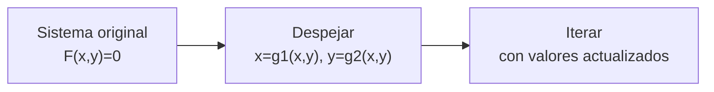

```python
fixed_point_functions = [
    lambda x, y: np.sqrt(-y + x + 0.75),
    lambda x, y: (x**2) / (1 + 5*x)
]

system = NonLinearSystem(functions, [1.2, 1.2])

solution, iterations, error = system.solved_by_fixed_point(
    fixed_point_functions,
    tol=1e-4,
    max_iteration=100
)

show_solution_set(solution, iterations, ['x', 'y'], error)
```

> **Punto fijo depende muchísimo del despeje.** El mismo sistema puede converger o divergir dependiendo de cómo se despejen las ecuaciones. Si no converge, prueba otra formulación \(g_1,g_2\) o usa Newton-Raphson.

---

## Cómo Leer `show_solution_set`

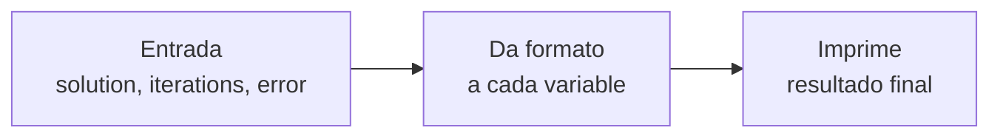

```python
# Para variables x_1, x_2, x_3...
show_solution_set(solution, iterations, 'x', error)

# Para variables con nombre propio
show_solution_set(solution, iterations, ['x', 'y'], error)

# Para poner un título al resultado
show_solution_set(
    solution,
    iterations,
    ['x', 'y'],
    error,
    system_name='Usando Newton-Raphson'
)
```

Forma de la salida:

```text
Conjunto solución | Usando Newton-Raphson
x = 1.372065
y = 0.239502
Resultados obtenidos a 5 iteraciones
Error = 8.935694e-06 %
```

---

## Diagnóstico Rápido de Errores

| Síntoma | Causa probable | Solución |
|---|---|---|
| `ModuleNotFoundError` | El notebook no ve `LNL-Solver.py`. | Coloca el archivo en la misma carpeta o usa `sys.path.append`. |
| `from LNL-Solver.py import *` falla | Se incluyó la extensión `.py`. | Usa `from LNL-Solver import *`. |
| Matriz singular en Newton | Jacobiano no invertible en el punto actual. | Cambia el punto inicial o revisa derivadas. |
| Gauss-Seidel no converge | La matriz no garantiza convergencia. | Reordena ecuaciones, pivotea o usa otro método. |
| Cero en diagonal | División por cero en método iterativo. | Reordena filas o reformula el sistema. |
| Resultados viejos tras editar el solver | Jupyter ya había cargado el módulo. | Reinicia kernel o usa `reload`. |

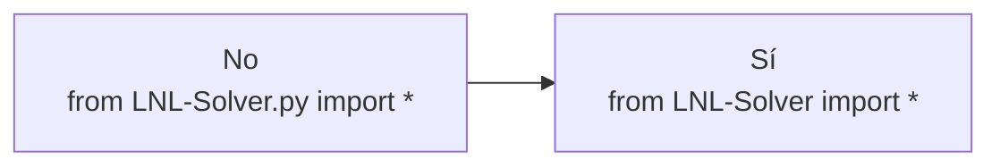

---

## Recetas de Uso

### Receta A: resolver \(Ax=b\) con Gauss-Seidel

```python
import numpy as np
from LNL-Solver import *

A = np.array([
    [4, -1, 0],
    [-1, 4, -1],
    [0, -1, 4]
])

b = np.array([[15], [10], [10]])
x0 = [0, 0, 0]

system = LinearSystem(A, b, x0)
system.convergence()

solution, iterations, error = system.solved_by_gauss_seidel(
    'combined',
    absolute_tol=1e-6,
    residue_tol=1e-8
)

show_solution_set(solution, iterations, 'x', error)
```

### Receta B: comparar Gauss-Seidel con método directo

```python
iter_solution, iter_n, iter_error = system.solved_by_gauss_seidel(
    'residue',
    tol=1e-8
)

direct_solution, direct_n, direct_error = system.solved_by_matrix_direct_method()

show_solution_set(iter_solution, iter_n, 'x', iter_error)
show_solution_set(direct_solution, direct_n, 'x', direct_error)
```

### Receta C: graficar el historial de convergencia

```python
import matplotlib.pyplot as plt

errors = [item['residue'] for item in system.history]

plt.semilogy(range(1, len(errors) + 1), errors, marker='o')
plt.xlabel('Iteración')
plt.ylabel('Residuo')
plt.grid(True)
plt.show()
```

---

## Ejemplos Tomados de la Práctica

### Ejemplo 1: Gauss-Seidel, reordenamiento e historial

En la Actividad 5 se resolvió el sistema:

$$
\begin{aligned}
x+5y+z&=7,\\
4x+y+2z&=8,\\
3x+2y+z&=6.
\end{aligned}
$$

El objetivo no era solo obtener la solución, sino observar cómo cambia la convergencia cuando se reordenan las ecuaciones.

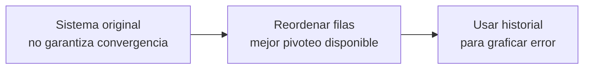

```python
original_errors = [
    item['absolute_error']
    for item in system5_original.history
]

pivot_errors = [
    item['absolute_error']
    for item in system5_pivot.history
]

plt.semilogy(
    range(1, len(original_errors) + 1),
    original_errors,
    marker='o',
    label='Sin reordenar'
)

plt.semilogy(
    range(1, len(pivot_errors) + 1),
    pivot_errors,
    marker='o',
    label='Reordenado'
)
```

| Caso | \(x_1\) | \(x_2\) | \(x_3\) |
|---|---:|---:|---:|
| Sin reordenar, 20 iter. | \(1.449650\times10^{24}\) | \(-6.891680\times10^{24}\) | \(9.434409\times10^{24}\) |
| Reordenado, 20 iter. | 0.749997 | 0.833330 | 2.083341 |
| Método directo | 0.750000 | 0.833333 | 2.083333 |


> **Qué enseña este ejemplo.** El historial no es adorno: permite detectar divergencia. En el caso original el error explota; en el caso reordenado el error cae hasta aproximadamente \(1.542573\times10^{-5}\). Por eso `history` es la herramienta natural para justificar convergencia en el reporte.

### Ejemplo 2: Newton-Raphson con varios puntos iniciales

En la Actividad 8 se resolvió:

$$
x^2+y^2=4,
\qquad
x^2-y=1.
$$

La gráfica permite ver que Newton-Raphson puede converger a raíces distintas dependiendo del punto inicial.

| Punto inicial | Resultado | Iter. | Lectura |
|---|---|---:|---|
| `[1,1]` | `(1.517490, 1.302776)` | 5 | raíz derecha |
| `[0,2]` | Jacobiano singular | -- | no converge |
| `[-1,1]` | `(-1.517490, 1.302776)` | 5 | raíz izquierda |
| `[2,0]` | `(1.517490, 1.302776)` | 6 | raíz derecha |
| `[-0.2,0.2]` | `(-1.517490, 1.302776)` | 8 | raíz izquierda |
| `[0.5,0.5]` | `(1.517490, 1.302776)` | 6 | raíz derecha |


> **Interpretación.** Newton-Raphson no elige una raíz global. Parte de un punto, evalúa \(F\) y \(J\), y avanza localmente. Si el Jacobiano es singular, la matriz \(J^{-1}\) no existe y el método falla. Si hay varias raíces, el punto inicial determina hacia cuál se mueve.

### Ejemplo 3: comparar criterios de parada en Newton

En la Actividad 9 se usó el sistema:

$$
\begin{cases}
-x^2+x+0.75-y=0,\\
x^2-5xy-y=0.
\end{cases}
$$

El mismo método puede detenerse por error máximo, error euclidiano, residuo o criterio combinado.

```python
criteria9 = [
    ['a) Max absoluto', 'max_absolute_error', 1e-6],
    ['b) Euclidiano', 'euclidean_error', 1e-6],
    ['c) Residuo', 'residue', 1e-8],
    ['d) Combinado', 'combined', None]
]
```

| Criterio | Tolerancia | Iter. | \(x\) | \(y\) |
|---|---|---:|---:|---:|
| Max absoluto | \(10^{-6}\) | 5 | 1.372065 | 0.239502 |
| Euclidiano | \(10^{-6}\) | 5 | 1.372065 | 0.239502 |
| Residuo | \(10^{-8}\) | 5 | 1.372065 | 0.239502 |
| Combinado | \(10^{-6}\) y \(10^{-8}\) | 5 | 1.372065 | 0.239502 |

> **Por qué todos dieron la misma iteración.** En ese ejemplo, en la iteración 4 todavía no se cumplía ninguno de los criterios y en la iteración 5 se cumplían todos. Por eso la solución coincide; lo que cambia es la magnitud que se reporta como error final.

### Ejemplo 4: diagrama dinámico de Newton-Raphson

En la Actividad 12 se probó una malla de puntos iniciales para el sistema de la Actividad 6. Cada punto de la malla se colorea según la raíz a la que converge.

```python
for point in points:
    try:
        system = NonLinearSystem(non_linear_functions, point)
        solution, iterations, error = system.solved_by_newton_raphson(
            jacobian_functions,
            tol=1e-10
        )
        # Clasificar la raíz encontrada
    except np.linalg.LinAlgError:
        # Punto donde el Jacobiano no fue invertible
        pass
```


> **Lectura gráfica.** Una región grande de un color significa que muchos puntos iniciales llegan a la misma raíz. Las fronteras entre colores son zonas sensibles: pequeños cambios en el punto inicial pueden llevar a otra solución o a problemas de convergencia.

---

## Checklist Antes de Entregar

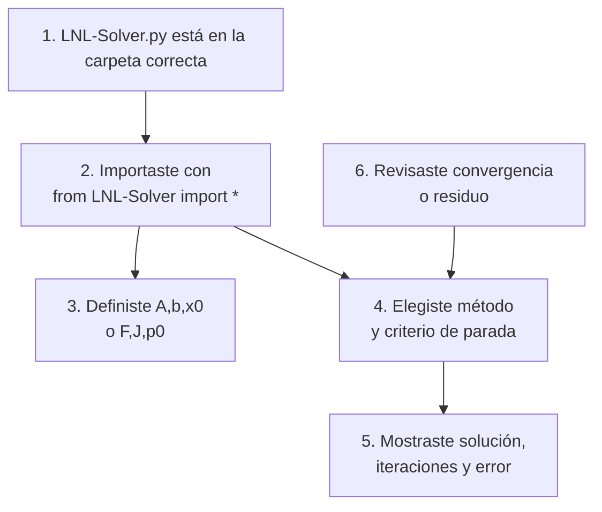

> **Regla de oro.** Primero formula bien el problema matemático. Después codifica matrices, funciones y derivadas. El solver automatiza las iteraciones, pero la calidad del resultado depende de que el sistema esté bien planteado.

---

## Resumen Visual Final

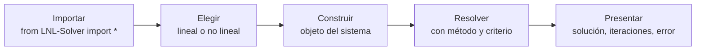

